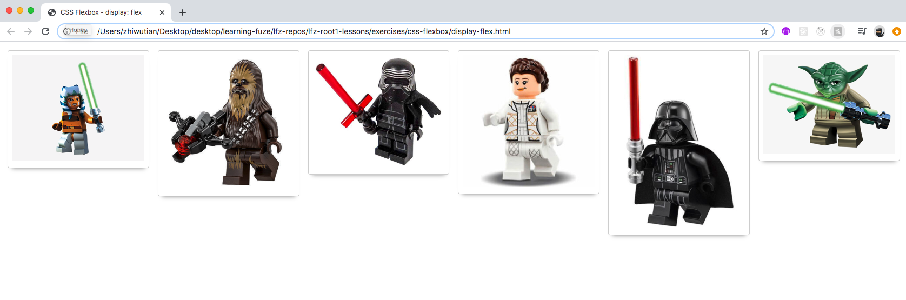
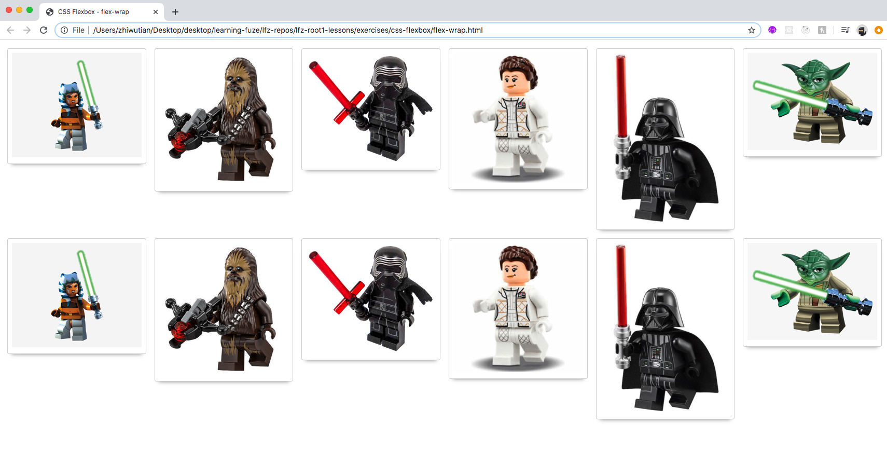
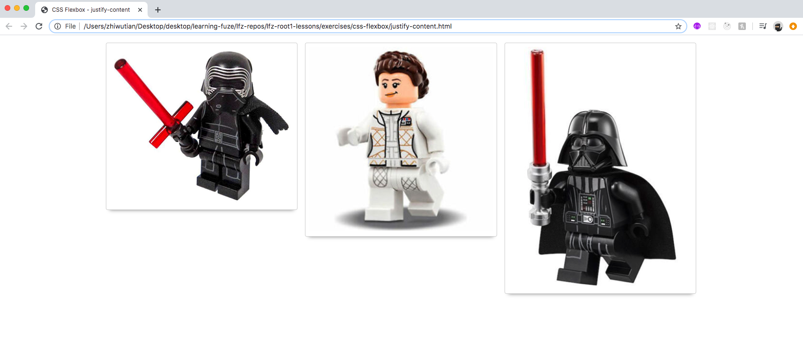
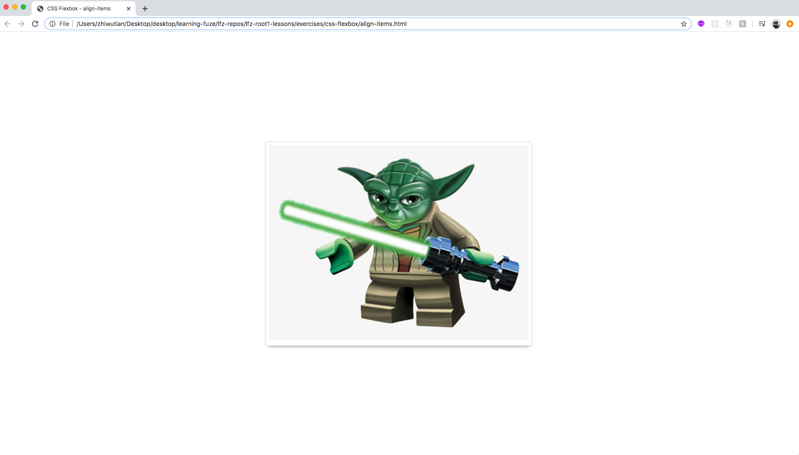

# prep-css-flexbox

Using the Flexible Box Layout module of CSS to control element size and page layout.

## Before You Begin

Be sure to check out a new branch from `main` for this exercise. Detailed instructions can be found [**here**](../../guides/starting-an-exercise).

## Quiz

After completing this exercise, you should be able to discuss or answer the following questions:

- What is the default `flex-direction` of a `flex` container?
- What is the default `flex-wrap` of a `flex` container?
- What is one of the uses of Flexbox?

## Exercise

Flexible Box Layout is a module of CSS made up of a range of properties that allow you to easily control the size and layout of elements on a web page. In this exercise, you'll be completing a series of challenges involving some of the flexbox CSS properties.

Each challenge comes with its own HTML document, and shares some styles in `reset.css` and `starwars.css`. **You won't need to modify `reset.css` or `starwars.css`.** Instead, you'll be adding some additional CSS to the `<style>` tag of each HTML document.

1. Read about [CSS Selectors](https://www.w3schools.com/css/css_selectors.asp) on W3Schools.
1. Bookmark the [CSS-Tricks Complete Guide to Flexbox](https://css-tricks.com/snippets/css/a-guide-to-flexbox/).
1. Bookmark the [MDN Guide to Flexbox](https://developer.mozilla.org/en-US/docs/Learn/CSS/CSS_layout/Flexbox).
1. Bookmark the [Flexbox Froggy](https://flexboxfroggy.com/) learning game.
1. Read through all of the CSS in `reset.css` and `starwars.css`.

#### `display: flex`

1. Read all of the code in `display-flex.html` and open it in your browser.
1. Use [the flexbox cheat sheet](https://css-tricks.com/snippets/css/a-guide-to-flexbox/) for reference.
1. Set the card deck's `display` property to `flex`. The default `flex-direction`  of a `flex` container is `row`, so the star wars cards should appear in a horizontal row automatically.
1. Give the element with the `card-deck` id some padding to move the cards away from the edge of the viewport.
1. Give the elements with the `card-wrapper` class some padding to add some whitespace around each card.

##### Example

#### `flex-wrap`

1. Read about [CSS Selectors](https://www.w3schools.com/css/css_selectors.asp) on W3Schools.
1. Read all of the code in `flex-wrap.html` and open it in your browser.
1. Use [the flexbox cheat sheet](https://css-tricks.com/snippets/css/a-guide-to-flexbox/) for reference.
1. Make the card deck a `flex` container by setting its `display` property to `flex`.
1. Allow items within the card deck to appear on a new row by setting its `flex-wrap` property to `wrap`.
1. Make only six card wrappers appear per row by setting their `flex-basis` to one-sixth of the card deck's width - _i.e._ `calc(100% / 6)`.
1. Give the element with the `card-deck` id some padding to move the cards away from the edge of the viewport.
1. Give the elements with the `card-wrapper` class some padding to add some whitespace around each card.

##### Example

#### `justify-content`

1. Read about [CSS Selectors](https://www.w3schools.com/css/css_selectors.asp) on W3Schools.
1. Read all of the code in `justify-content.html` and open it in your browser.
1. Use [the flexbox cheat sheet](https://css-tricks.com/snippets/css/a-guide-to-flexbox/) for reference.
1. Make the card deck a `flex` container by setting its `display` property to `flex`.
1. Make each card wrapper one-fourth the width of the card deck by setting their `flex-basis` property to `25%`.
1. Center the row of card wrappers by setting the card deck's `justify-content` property to `center`.
1. Give the element with the `card-deck` id some padding to move the cards away from the edge of the viewport.
1. Give the elements with the `card-wrapper` class some padding to add some whitespace around each card.

##### Example

#### `align-items`

1. Read about [CSS Selectors](https://www.w3schools.com/css/css_selectors.asp) on W3Schools.
1. Read all of the code in `align-items.html` and open it in your browser.
1. Use [the flexbox cheat sheet](https://css-tricks.com/snippets/css/a-guide-to-flexbox/) for reference.
1. Make the card deck a `flex` container by setting its `display` property to `flex`.
1. Make the card wrapper take up only one-third of the card deck's width by setting its `flex-basis` property to `calc(100% / 3)`.
1. Make the card deck take up the entire viewport height by settings its `min-height` property to `100vh`. By doing this, there will now be extra vertical room for the card to be centered within.
1. Center the card wrapper vertically and horizontally by setting the **card deck's** `align-items` and `justify-content` properties to `center`.

## Submitting Your Solution

When your solution is complete, submit a Pull Request on GitHub. Detailed instructions can be found [**here**](../../guides/submitting-your-solution).
