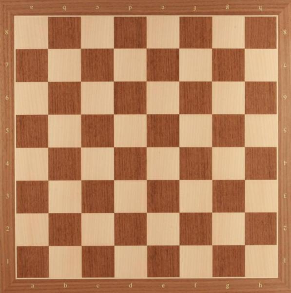
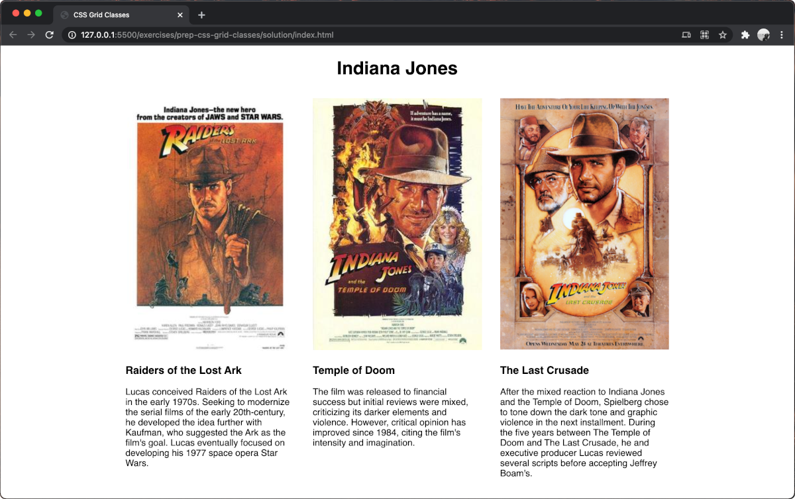

# prep-css-layout-classes

Using flexbox to build a basic layout system in CSS.

## Before You Begin

Be sure to check out a new branch from `main` for this exercise. Detailed instructions can be found [**here**](../../guides/starting-an-exercise).

## Quiz

After completing this exercise, you should be able to discuss or answer the following questions:

- What are the three primary parts of a layout system?

## Exercise

A "layout system" is not a specific tool in CSS, but rather a pattern for organizing CSS to control the size and layout of elements. Layout systems include three primary parts: an element to be the **container**, one or more elements acting as a **row**, and at least one **column** element in each of the **row** elements. To be clear, these are ***NOT*** the names of actual elements in HTML (i.e. `<container>`), they are simply roles an element can play within an HTML document.

A great way to visualize a layout system is with a chess board. In this example, imagine that the **container** element is the boundary enclosing all squares of the board. The **row** elements would be each horizontal row of squares, and the **column** elements would be the individual squares in each **row**.

  

1. Review [CSS Selectors](https://www.w3schools.com/css/css_selectors.asp) on W3Schools.
1. Open the included `index.html` and note the three CSS rule-sets which are included. Each rule-set includes a selector for `class` attributes (`.container`, `.row`, and `.column`).
1. Let's start by discussing the purpose of the `.container` class:
    - The `.container` will contain child `row` elements.
    - The `.container` will be a fixed in width so that its child elements will always have a set boundary that they must fit within.
    - In the context of our example chess board, think of the entire board as a "container" for all of its "rows".
1. On to the purpose of the `.row` class:
    - A `.row` is used to denote one full-width segment of vertical space in a `.container`.
    - Looking at the chess board above, note that there are eight "rows".
1. The smallest piece of the layout we will look at is the `.column` class:
    - The `.column` class will be used to indicate some segment of horizontal space inside of a `.row`.
    - Looking again at the chess board example above, note that each "row" has eight evenly-sized "columns". They happen to be square-shaped on the chess board.
    - To create eight evenly-spaced columns in CSS would mean that each `.column` is 12.5% the width of its parent `.row`: as in `calc(100% / 8)`.

1. Now that we are familiar with the core concepts, let's add the needed CSS properties to each class in the included `index.html` file to create a basic page layout.
    _____
    **NOTE:** The layout system you will be building in this exercise is ***not*** an example of a layout system you would use in an actual application. It limited to only work on layouts where you want three columns in each row. This exercise is only meant to be an introduction to the **concept** of a layout system.
    _____
    - In the rule-set for the `.container` class selector:
        - Set the `max-width` property to a value of `992px`.
        - Now, add the `margin` property with the `auto` value. This will cause the container element to center itself horizontally within the `body` using any available width of the viewport beyond its `992px` width.
    - In the rule-set for the `.row` class selector:
        - Assign the `width` property a value of `100%` to ensure each `row` takes up the full width of the its parent element.
        - Assign the `display` property a value of `flex` so that its children line up in a "row".
    - In the rule-set for the `.column` class selector:
        - Assign the `flex-basis` property a value which will allow **three** elements to sit next to each other on a single horizontal line, as in: `calc(100% / 3)`.
        - Assign the `padding-left` and `padding-right` properties each a value of `8px` so that the contents of each "column" are given some space to breathe.
    - A few more lines of CSS will be required to get your output to match the provided example result, but the CSS for the layout system is now complete.

1. Now that your basic layout system is ready, create the example output below:
    - Your HTML will require:
        1. A `div` element with a `class` attribute of `"container"`, which contains:
        1. A `div` element with a `class` attribute of `"row"`, which contains:
        1. Three `div` elements with a `class` attribute of `"column"`.
    - Each of the three `div` elements will contain:
        1.  an `img` element with the `src` attribute set to the corresponding relative url for an image in the `images` directory. **Tip:** set all `img` elements to a `width` of `100%` in your CSS.
        1. an `h3` element for the name of the film
        1. and a short paragraph about the film within a `p` element.
1. You are encouraged to include additional CSS to meet the design goal if needed.

## Example Result

  

## Submitting Your Solution

When your solution is complete, submit a Pull Request on GitHub. Detailed instructions can be found [**here**](../../guides/submitting-your-solution).
